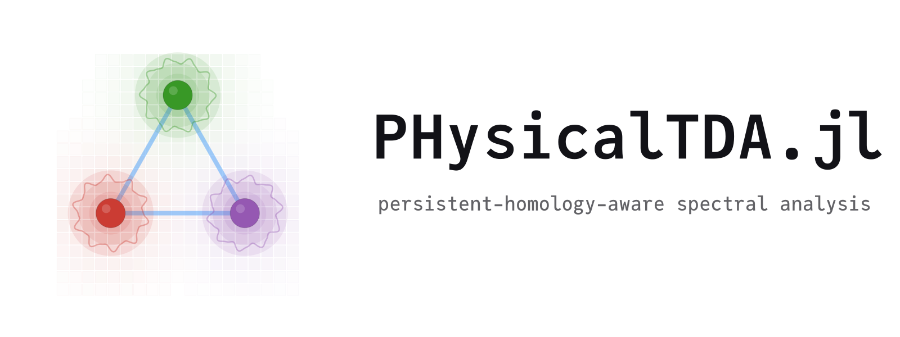

    <picture>
      <source media="(prefers-color-scheme: dark)" srcset="docs/src/assets/dark-mode-banner.svg">
      
    </picture>

`PHysicalTDA.jl` performs Topological Data Analysis (TDA) by utilizing Persistence Homology (PH) on scattering datasets.
It is written to be handle both synthetic and raw datasets. The module currently supports Julia native and `Sunny.jl` types.
It will support NXS, JLD2, and ASCII datasets for analysis of raw measurements in the future. 
